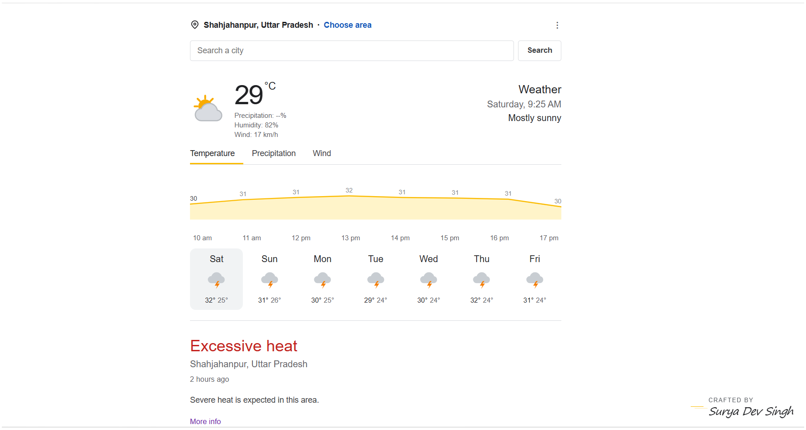

# Weather Forecast

A polished, responsive weather experience for **Shahjahanpur, Uttar Pradesh**, built as a single dependency-free HTML file.

It combines a Google Weather-inspired glanceable layout with live forecasts from the [Open-Meteo API](https://open-meteo.com/), including interactive temperature, precipitation, and wind charts.

## Live forecast

**[Open Weather Forecast](https://surya01dev.github.io/weather-forecast/)**

The live site opens directly in your browser and defaults to Shahjahanpur, Uttar Pradesh. GitHub Pages may take a minute or two to publish after the first setup.

## Preview



## Features

- Live city search with Open-Meteo geocoding
- Current temperature, humidity, wind, and weather condition
- Seven-day forecast with weather icons and high/low temperatures
- Interactive hourly charts for:
  - Temperature
  - Precipitation probability
  - Wind speed
- Graceful fallback data when the API is unavailable
- Responsive layout for desktop and mobile screens
- No framework, build step, API key, or package installation required
- Elegant "Crafted by Surya Dev Singh" signature

## Run locally

Because this is a static app, you can open `index.html` directly in a browser.

For a local development server, use any static file server. For example:

```bash
python -m http.server 8000
```

Then open [http://localhost:8000](http://localhost:8000).

## Deploy

This project is published with GitHub Pages at the live link above. It can also be hosted on Netlify, Vercel, or any static hosting provider using `index.html` as the entry point.

## Data and fallback behavior

Weather data is provided by Open-Meteo and does not require an API key. If geocoding or forecast requests fail, the interface displays a clearly labeled sample forecast so the layout remains usable.

## Project structure

```text
.
|-- index.html   # Complete application: markup, styles, icons, and JavaScript
|-- assets/
|   `-- weather-preview.png
|-- LICENSE      # MIT license
`-- README.md    # Project documentation
```

## License

Released under the [MIT License](LICENSE).

---

Crafted with care by **Surya Dev Singh**.
